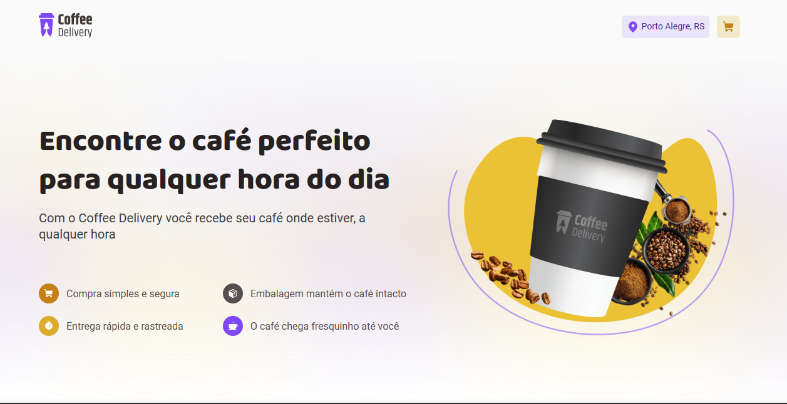
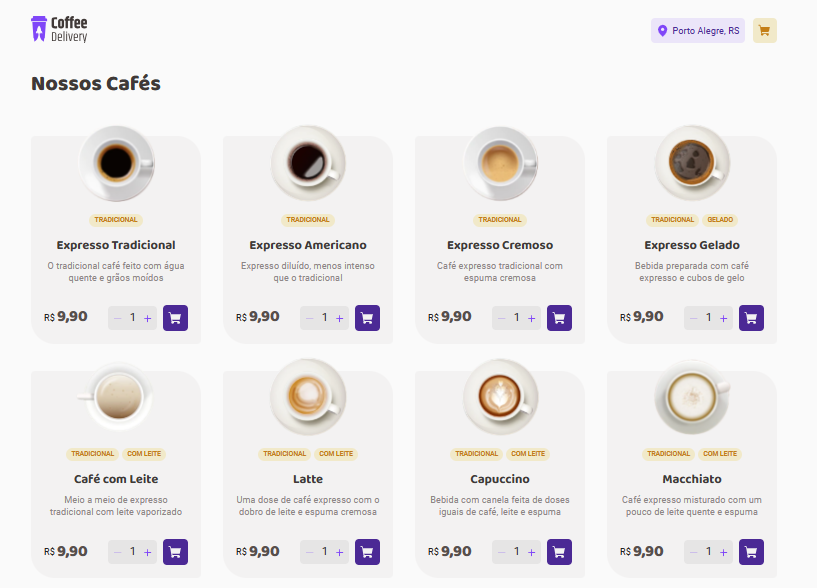
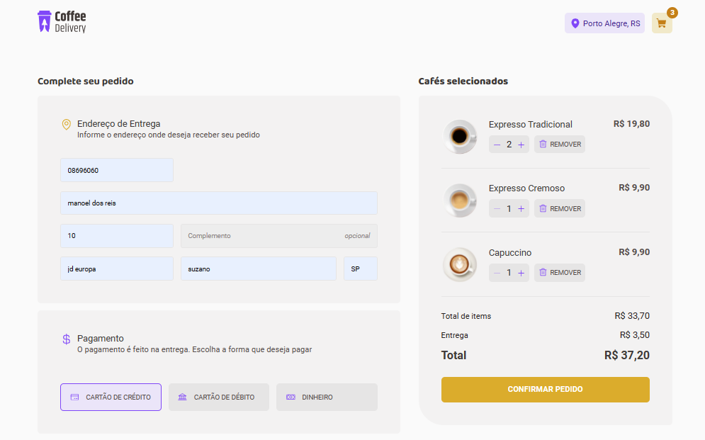
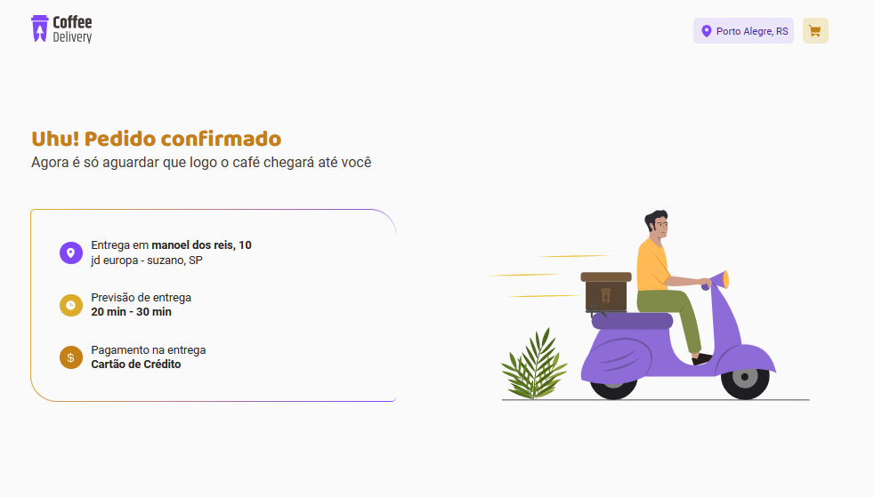

# Coffee Delivery - Aplicação de Encomenda de Cafés ☕️
 

Durante este desafio, desenvolvemos do zero uma aplicação para encomendar cafés! Esta aplicação oferece uma experiência de compra de café simplificada, com três telas intuitivas para navegação e interação.

## Funcionalidades Principais

1. **Tela de Apresentação e Listagem de Cafés:**
   - Apresenta uma introdução à aplicação e lista os cafés disponíveis para compra.
    
   
   - Quantidade de cafés selecionados
   

2. **Formulário de Pedido e Carrinho de Compras:**
   - Permite ao usuário preencher um formulário com seus dados de endereço.
   - Ao lado direito, exibe os itens selecionados no carrinho, oferecendo a opção de ajustar a quantidade ou remover itens.
   

3. **Confirmação do Pedido e Detalhes de Entrega:**
   - Apresenta uma confirmação do pedido, juntamente com os detalhes de entrega.
   

## Tecnologias Utilizadas

- **Vite:** Ferramenta de construção rápida para projetos baseados em JavaScript.
- **Styled Components:** Biblioteca para estilização de componentes no React.
- **Local Storage:** Para armazenamento local de dados do carrinho de compras.
- **TypeScript:** Linguagem de programação para desenvolvimento mais seguro e escalável.
- **Context API:** Para gerenciamento de estado global na aplicação React.
- **React Router Dom:** Para navegação entre as diferentes telas da aplicação.
- **React Hook Form:** Para facilitar a criação e validação de formulários.
- **Validações de Formulário com Zod:** Utilizado para validar os dados inseridos nos formulários.

## Como Executar o Projeto

1. Clone o repositório para o seu ambiente local.
2. Certifique-se de ter o Node.js instalado.
3. No diretório raiz do projeto, execute o comando `npm install` para instalar as dependências.
4. Após a instalação das dependências, execute `npm start` para iniciar a aplicação.
5. Acesse a aplicação no seu navegador, normalmente disponível em `http://localhost:3000`.

## Contribuindo

Contribuições são bem-vindas! Sinta-se à vontade para abrir um problema ou enviar um pull request para melhorar este projeto.

## Autores

Este projeto foi desenvolvido por Natalye Cavalieri, como parte de um desafio de programação pela escola Rocketseat.

---

Divirta-se encomendando os melhores cafés com a nossa aplicação! Qualquer dúvida ou sugestão, não hesite em nos contatar. 😊☕️

